# basic-helm-chart

### Инструкция по установке helm чарта
Требования:
1. Установленное k8s-решение, например, MicroK8s или minikube.
2. Установленный локальный kubectl.
3. Установленный локальный Helm.
---

### Подготовка среды и установка helm чарта

***Создаем неймспейсы(namespaces)***

```bash
kubectl create ns app1

kubectl create ns app2
```
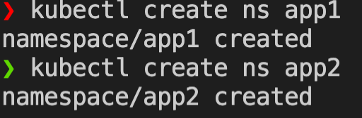


***При помощи готового [helm chart](nginx) устанавливаем 3 разных версии приложение nginx***

Версия 1.23.0 в неймспейсе app1
```bash
helm upgrade --install --atomic nginx1 nginx/ --namespace app1 --set image.tag=1.23.0
```
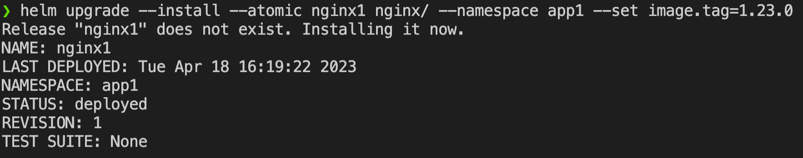

Версия 1.22.0 в неймспейсе app1
```bash
helm upgrade --install --atomic nginx2 nginx/ --namespace app1 --set image.tag=1.22.0
```


Версия 1.24.0 в неймспейсе app2
```bash
helm upgrade --install --atomic nginx3 nginx/ --namespace app2 --set image.tag=1.24.0
```
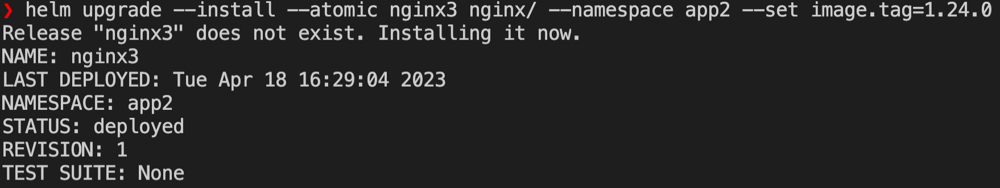

---
### Проверка работоспобности приложения
Проверяем статус хелм чартов в неймспейсе app1
```bash
helm -n app1 list
```
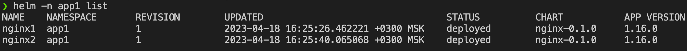

Проверяем статус подов в неймспейсе app1
```bash
kubectl -n app1 get po
```
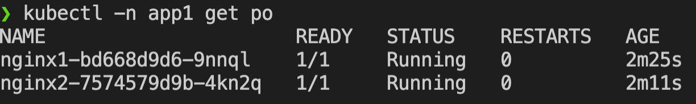

Пробрасываем себе локально приложение nginx1 на порт 8881
```bash
kubectl -n app1 port-forward svc/nginx1 8881:80
```
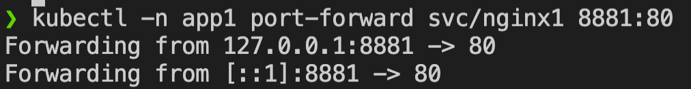

Проверяем работоспобность при помощи curl во втором окне терминала и в поле Server сверяем версию нашего приложения
```bash
curl localhost:8881 -I
```
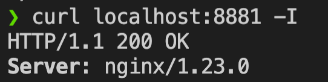

Подобным образом проверяем работу приложения nginx2, а именно пробрасываем себе локально приложение на порт 8882
```bash
kubectl -n app1 port-forward svc/nginx2 8882:80
```
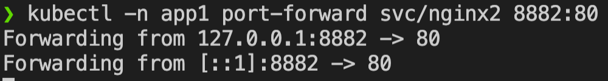

Проверяем работоспобность при помощи curl во втором окне терминала и в поле Server сверяем версию нашего приложения
```bash
curl localhost:8882 -I
```
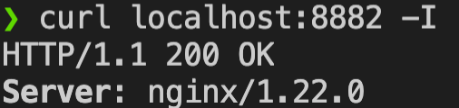


Далее проверяем статус хелм чарта в неймспейсе app2
```bash
helm -n app2 list
```
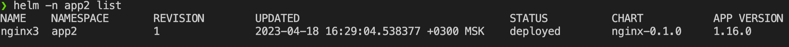

Проверяем статус подов в неймспейсе app2
```bash
kubectl -n app2 get po
```
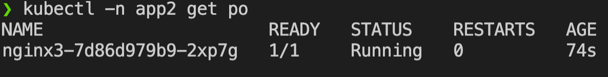

Пробрасываем себе локально приложение nginx3 на порт 8883
```bash
kubectl -n app2 port-forward svc/nginx3 8883:80
```
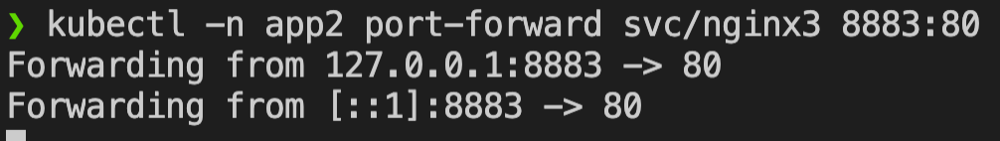

Проверяем работоспобность при помощи curl во втором окне терминала и в поле Server сверяем версию нашего приложения
```bash
curl localhost:8883 -I
```
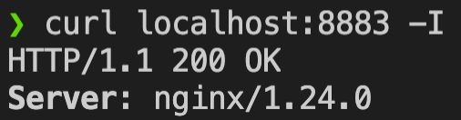
